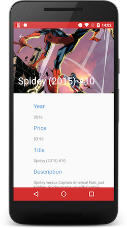

MarvelApp
=========

Wallapop Android tech test

Screenshots
===========

 


Architecture
============

* Clean Architecture with 2 layers: domain and presentation/ui
* Use of MVP in the presentation layer
* Use of Dagger 2 for dependency injection
* Use of reactive pattern, so Use cases return an ```Observable<T>``` and all lower layers must follow this rule.

Dependencies
============

* [RxJava](https://github.com/ReactiveX/RxJava)
* [Retrofit](https://github.com/square/retrofit)
* [Dagger 2](https://github.com/google/dagger)
* [Gson](https://github.com/google/gson)
* [Butterknife](https://github.com/JakeWharton/butterknife)
* [Glide](https://github.com/bumptech/glide)
* [LeakCanary](https://github.com/square/leakcanary)

Optimizations
=============

* Caching comic list 

License
=======
```
Copyright (c) 2016 Simone Bellotti

Licensed under the Apache License, Version 2.0 (the "License");
you may not use this file except in compliance with the License.
You may obtain a copy of the License at

   http://www.apache.org/licenses/LICENSE-2.0

Unless required by applicable law or agreed to in writing, software
distributed under the License is distributed on an "AS IS" BASIS,
WITHOUT WARRANTIES OR CONDITIONS OF ANY KIND, either express or implied.
See the License for the specific language governing permissions and
limitations under the License.

```